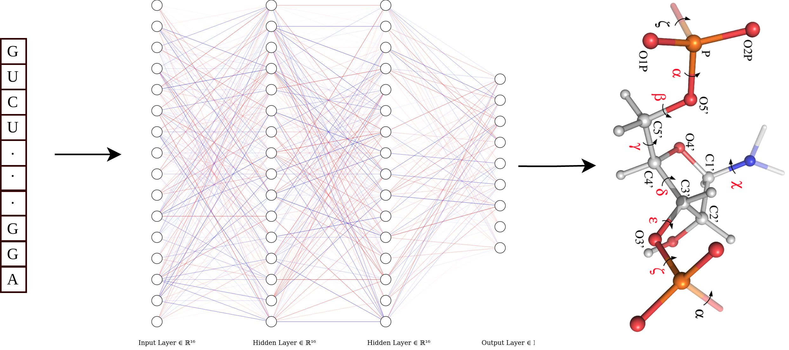

SPOT-RNA-1D: *RNA Backbone Torsion and Pseudotorsion Angle Prediction using Dilated Convolutional Neural Networks*
====

Contents
----
  * [Introduction](#introduction)
  * [System Requirments](#system-requirments)
  * [Installation](#installation)
  * [Usage](#Usage)
  * [Citation guide](#citation-guide)
  * [Licence](#licence)
  * [Contact](#contact)

Introduction
----
RNA three-dimensional structure prediction has been relied on using predicted or experimentally determined secondary structure as restrains to reduce conformational sampling space. However, the secondary-structure restraints are limited to paired bases, and the conformational space of the ribose-phosphate backbone is still too large to be sampled efficiently. Here, we employed the dilated convolutional neural network to predict backbone torsion and pseudotorsion angles using a single RNA sequence as input. The method called SPOT-RNA-1D was trained on a high-resolution training dataset and tested on three independent, non-redundant, and high-resolution test sets. The proposed method yields substantially smaller mean absolute errors than the baseline predictors based on random predictions and based on helix conformations according to actual angle distributions. The mean absolute errors for three test sets range from 14◦ -44◦ for different angles, compared to 17◦ -62◦ by random prediction and 14◦ -58◦ by helix prediction. The method also accurately recovers the overall patterns of single or pairwise angle distributions. In general, torsion angles further away from the bases and associated with unpaired bases and paired bases involved in tertiary interactions are more difficult to predict. Compared to the best models in RNA-puzzles experiments, SPOT-RNA-1D yielded more accurate dihedral angles and, thus, are potentially useful as model quality indicators and restraints for RNA structure prediction as in protein structure prediction.

|
|----|


System Requirments
----


**Hardware Requirments:**
SPOT-RNA-1D predictor requires only a standard computer with around 32 GB RAM to support the in-memory operations for RNAs sequence length less than 2000.

**Software Requirments:**
* [Python3](https://docs.python-guide.org/starting/install3/linux/)
* [virtualenv](https://virtualenv.pypa.io/en/latest/installation/) or [Anaconda](https://anaconda.org/anaconda/virtualenv)
* [CUDA 10.0](https://developer.nvidia.com/cuda-10.0-download-archive) (Optional If using GPU)
* [cuDNN (>= 7.4.1)](https://developer.nvidia.com/cudnn) (Optional If using GPU)

SPOT-RNA-1D has been tested on Ubuntu 14.04, 16.04, and 18.04 operating systems.


Installation
----

To install SPOT-RNA-1D and it's dependencies following commands can be used in terminal:

1. `git clone https://github.com/jaswindersingh2/SPOT-RNA-1D.git && cd SPOT-RNA-1D`
2. `wget -O checkpoints.tar.xz 'https://www.dropbox.com/s/r9hp20gk30unptf/checkpoints.tar.xz' || wget -O checkpoints.tar.xz 'https://app.nihaocloud.com/f/4d2385c633554ccaa85c/?dl=1'`
3. `tar -xvf checkpoints.tar.xz && rm checkpoints.tar.xz`

Either follow **virtualenv** column steps or **conda** column steps to create virtual environment and to install SPOT-RNA-1D dependencies given in table below:<br />

|  | &nbsp;&nbsp;&nbsp;&nbsp;&nbsp;&nbsp;&nbsp;&nbsp;&nbsp;&nbsp;&nbsp;&nbsp;&nbsp;&nbsp;&nbsp;&nbsp;&nbsp;&nbsp;&nbsp;&nbsp;&nbsp; virtualenv | &nbsp;&nbsp;&nbsp;&nbsp;&nbsp;&nbsp;&nbsp;&nbsp;&nbsp;&nbsp;&nbsp;&nbsp;&nbsp;&nbsp;&nbsp;&nbsp;&nbsp;&nbsp;&nbsp;&nbsp;&nbsp;&nbsp;&nbsp;&nbsp;&nbsp;&nbsp;&nbsp;&nbsp;&nbsp;&nbsp;&nbsp;&nbsp;&nbsp;&nbsp;&nbsp;&nbsp; conda |
| :- | :-------- | :--- |
| 4. | `virtualenv -p python3.6 venv` | `conda create -n venv python=3.6` |
| 5. | `source ./venv/bin/activate` | `conda activate venv` | 
| 6. | *To run SPOT-RNA-1D on CPU:*<br /> <br /> `pip install tensorflow==1.15.0` <br /> <br /> &nbsp;&nbsp;&nbsp;&nbsp;&nbsp;&nbsp;&nbsp;&nbsp;&nbsp;&nbsp;&nbsp;&nbsp;&nbsp;&nbsp;&nbsp;&nbsp;&nbsp;&nbsp;&nbsp;&nbsp;&nbsp;&nbsp;&nbsp;&nbsp; *or* <br /> <br />*To run SPOT-RNA-1D on GPU:*<br /> <br /> `pip install tensorflow-gpu==1.15.0` | *To run SPOT-RNA-1D on CPU:*<br /> <br /> `conda install tensorflow==1.15.0` <br /> <br /> &nbsp;&nbsp;&nbsp;&nbsp;&nbsp;&nbsp;&nbsp;&nbsp;&nbsp;&nbsp;&nbsp;&nbsp;&nbsp;&nbsp;&nbsp;&nbsp;&nbsp;&nbsp;&nbsp;&nbsp;&nbsp;&nbsp;&nbsp;&nbsp; *or* <br /> <br />*To run SPOT-RNA-1D on GPU:*<br /> <br /> `conda install tensorflow-gpu==1.15.0` |
| 7. | `pip install -r requirements.txt` | `while read p; do conda install --yes $p; done < requirements.txt` | 

Usage
----

**To run the SPOT-RNA-1D**

```
./run.py --seq_file datasets/TS1_seqs.fasta --save_outputs outputs/
```

**For more options to run SPOT-RNA-1D**
```
./run.py --help
```

```
usage: use "./run.py --help" for more information

SPOT-RNA-1D: RNA backbone torsion and pseudotorsion angle prediction using dilated convolutional neural networks.

optional arguments:
  -h, --help       show this help message and exit
  --seq_file       Path to the input sequence fasta file
                   default file: ./SPOT-RNA-1D/datasets/TS1_seqs.fasta
  --save_outputs   Path to the folder for saving output
                   default folder: ./SPOT-RNA-1D/outputs
  --batch_size     Number of simultaneous prediction for multi sequence fasta file input
                   default batch size: 10
  --gpu            To run on GPU, specify GPU number. If only one GPU in the system specify 0
                   default: -1 (no GPU)
  --cpu            Specify number of cpu threads that SPOT-RNA-1D can use
                   default = 16

```


Citation guide
----

**If you use SPOT-RNA-1D for your research please cite the following paper:**

Singh, J., Paliwal, K., Singh, J., Zhou, Y., 2021. RNA Backbone Torsion and Pseudotorsion Angle Prediction using Dilated Convolutional Neural Networks. Journal of Chemical Information and Modeling, In-press.

Licence
----
Mozilla Public License 2.0


Contact
----
jaswinder.singh3@griffithuni.edu.au, zhouyq@szbl.ac.cn

